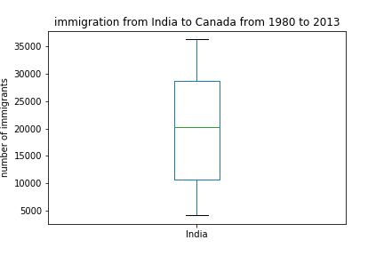

# matplotlib-plots-coursera

## Line Plot(line_plot.py)

## Area Plot(areaplot.py)

## Histogram(histogram.py)

## Bar graph(bargraph.py)

## Pie Chart(pie.py)

upgraded one 

## Box Plot(box.py)

## scatter plot(scatter.py)

## waffle plot
### creating a waffle plot  (code from scratch(waffle.py))

we have the plot with the colorbar

without the colorbar

hoewever i ran into some issues aligning the color of the plot with the legend 

### Using PyWaffle(pywaffletest.py) (https://github.com/gyli/PyWaffle)

using pywaffle library we did the same representation and it came out nicely

## Word Cloud  (https://github.com/amueller/word_cloud)

### wordcloud (wordcloudtest.py)

### wordcloud with mask (wordcloudmask.py)

we have our mask

fitting this to our wordcloud we have

###  wordcloud of the immigration to canada dataset (canadawordcloud.py)

## regression plot (regplot.py)

## Folium Library
### various basic maps with different layouts and one with a maker at the end (foliumtest.py)

world map

India map

India map with 'Stamen toner' layout

India map with 'Stamen terrain' layout

India map with a marker at my hometown Assam

## choropleth (choropleth.py)

